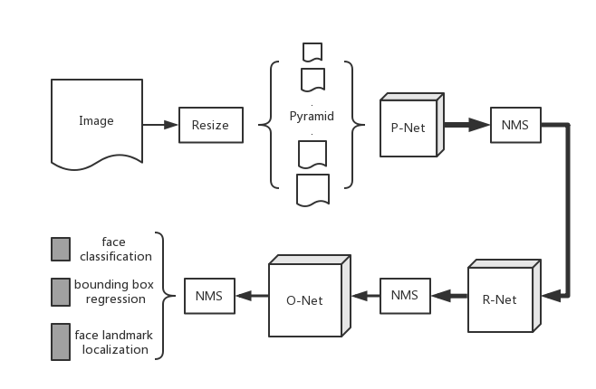

# MTMN

MTMN is a lightweight **Human Face Detection Model**, which is built around [a new mobile architecture called MobileNetV2](https://arxiv.org/abs/1801.04381) and [Multi-task Cascaded Convolutional Networks](https://arxiv.org/abs/1604.02878), and is specially designed for embedded devices.

## Overview

MTMN consists of three main parts:

1. Proposal Network (P-Net): Proposes candidate bounding boxes, and sends them to the R-Net;
2. Refine Network (R-Net): Screens the bounding boxes from P-Net;
3. Output Network (O-Net): Outputs the final results, i.e. the accurate bounding box, confidence coefficient and 5-point-landmark.

The following diagram shows the workflow of MTNM.



## Advance Configuration

`detect_face` provides the `config` parameter for users' customized definition.

```
box_array_t *face_detect(dl_matrix3du_t *image_matrix, mtmn_config_t *config);
```

The definition of `mtmn_config_t`:

```
typedef struct
{
    float min_face;                 /// The minimum size of a detectable face
    float pyramid;                  /// The scale of the gradient scaling for the input images
    threshold_config_t p_threshold; /// The thresholds for P-Net. For details, see the definition of threshold_config_t
    threshold_config_t r_threshold; /// The thresholds for R-Net. For details, see the definition of threshold_config_t
    threshold_config_t o_threshold; /// The thresholds for O-Net. For details, see the definition of threshold_config_t
} mtmn_config_t;

typedef struct
{
    float score;          /// The threshold of confidence coefficient. The candidate bounding boxes with a confidence coefficient lower than the threshold will be filtered out.
    float nms;            /// The threshold of NMS. During the Non-Maximum Suppression, the candidate bounding boxes with a overlapping ratio higher than the threshold will be filtered out.
    int candidate_number; /// The maximum number of allowed candidate bounding boxes. Only the first 'candidate_number' of all the candidate bounding boxes will be kept.
} threshold_config_t;
```

- **min_face**: 
	- Range: [12, the length of the shortest edge of the original input image). 
	- For an original input image of a fixed size, the smaller the `min_face` is, 
		- the larger the number of generated images of different sizes is;
		- the smaller the minimum size of a detectable face is;
		- the longer the processing takes
	- and vice versa.

- **pyramid**
	- Specifies the scale that controls the generated pyramids. 
	- Range: (0,1)
	- For an original input image of a fixed size, the larger the `pyramid` is,
		- the larger the number of generated images of different sizes is;
		- the higher the detection ratio is;
		- the longer the processing takes
	- and vice versa.

- **score threshold**
	- Range: (0,1)
	- For an original input image of a fixed size, the larger the `score` is,
		- the larger the number of filtered out candidate bounding boxes is
		- the lower the detection ratio is
	- and vice versa.

- **nms threshold**
	- Range: (0,1)
	- For an original input image of a fixed size, the larger the `nms` is,
		- the higher the possibility that an overlapped face can be detected is;
		- the larger the number of detected candidate bounding boxes of a same face is
	- and vice versa.

- **candidate number**
	- Specifies the number of the output candidate boxes of each network. 
	- Range
		- R-Net: [1,4]
		- O-Net: [1,2]
		- P-Net: 4, which indicates only four scaling images are used. Note that the `candidate_number` for P-Net is not open for user configuration now.
	- For an original input image of a fixed size, the larger the `candidate_number` is,
		- the larger the number of detected faces is;
		- the longer the processing takes
	- and vice versa.

Users can configure these parameters based on their actual requirements. Please also see the recommended configuration for general-purpose scenarios below:

```
mtmn_config.min_face = 80;
mtmn_config.pyramid = 0.7;
mtmn_config.p_threshold.score = 0.6;
mtmn_config.p_threshold.nms = 0.7;
mtmn_config.r_threshold.score = 0.7;
mtmn_config.r_threshold.nms = 0.7;
mtmn_config.r_threshold.candidate_number = 4;
mtmn_config.o_threshold.score = 0.7;
mtmn_config.o_threshold.nms = 0.4;
mtmn_config.o_threshold.candidate_number = 1;
```
