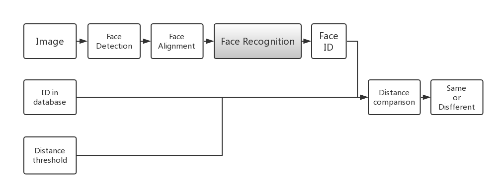

# FRMN

FRMN is a lightweight **Human Face Recognition Model**, which is built around [a new mobile architecture called MobileNetV2](https://arxiv.org/abs/1801.04381) and [the ArcFace Algorithm](https://arxiv.org/abs/1801.07698) and is specially designed for embedded devices.

## Overview

FRMN is built on MobileNetV2. In our training, we use the ArcFace Algorithm, instead of the traditional Softmax Function, and the Cross-Entropy Loss function.

To reduce the computation complexity, we use images of smaller size (56x56) in our training.

## Process of Face Recognition

The steps below list the whole process of a **Face Recognition**:

1. Obtain the input images.
2. Start the **Face Detection** and obtain the `position` and `landmark` coordinates of the face.
3. Align the face by using the `landmark` coordinates and obtain a face image of required size.
4. Input the aligned face image to the face recognition algorithm and generate a **Face ID**.
5. Compare the newly generated **Face ID** against the existing **Face IDs** and obtain the distance between these two **Face IDs** (normally in Euclidean distance or Cosine distance).
6. Determine if the two **Face IDs** are from a same person by comparing the distance between these two **Face IDs** and the specified threshold.

Please see the flowchart of face recognition below:

## API Configuration

- `FACE_REC_THRESHOLD`: The face recognition threshold, which is configured as `0.7` and measured in Cosine distance by default. 
    - Any two **Face IDs** with a distance greater than the `FACE_REC_THRESHOLD` is deemed as the same person. 
    - Lower this parameter to increase the recognition rate; and increase this parameter to reduce the rate of false recognition.

- `NOSE_EYE_RATIO_THRES_MIN`: The threshold for the minimum ratio of nose-to-left-eye-distance and nose-to-right-eye-distance. 
    - Any face image with a ratio lower than the threshold will be deemed as unqualified image and filtered out.
    - Lower this parameter to increase the passing rate of face alignment. Note that this also leads to images with poor quality being used in face recognition.

- `NOSE_EYE_RATIO_THRES_MAX`: The threshold for the maximum ratio of nose-to-left-eye-distance and nose-to-right-eye-distance. 
    - Any face image with a ratio higher than the threshold will be deemed as unqualified image and filtered out.
    - Increase this parameter to increase the passing rate of face alignment. Note that this also leads to images with poor quality being used in face recognition.

- `FLASH_INFO_FLAG`: The ID data flag. ID data exists in the flash whenever this flag is on.

- `FLASH_PARTITION_NAME`: Stores the name of the flash partition that stores **Face IDs**, which shares the same names used in the partitions.csv file.

## Precautions

Please note the followings when using our **Face Recognition Lib**:

- Only RGB images of 56x56 can be used as input images. Using images of other sizes might lower the rate of correct recognition.
- Call the **align_face()** function to start face alignment, and only after that, use the aligned images for your face recognition.
- If you want to use the **frmn_q()** function to generate **Face IDs**, please firstly make your input image normalized and fix-pointed by using the **transform_frmn_input()** function.
- **cos_distance()** and **euclidean_distance()** are used to calculate the distance between two **Face IDs**, in Cosine distance and Euclidean distance, respectively. 
    - For Cosine distance:
        - Range: [-1,1]
        - The larger the Cosine distance between two **Face IDs** is, the more similar these two **Face IDs** are.
    - For Euclidean distance:
        - Range: [0,4]
        - The larger the Euclidean distance between two **Face IDs** is, the more similar these two **Face IDs** are.
    - Note that, the Cosine distance is used in this example.
- To store your **Face ID** in the flash, instead of the RAM, please firstly configure your partitions.csv file.